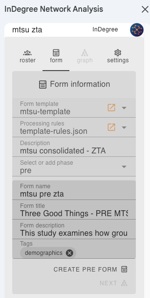
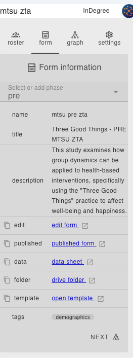
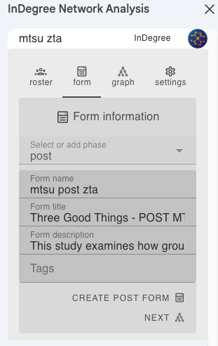
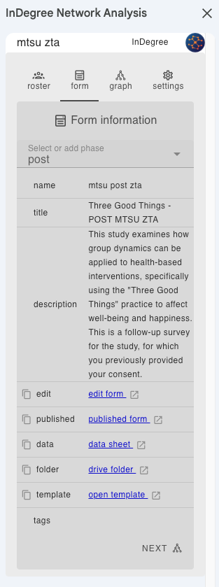
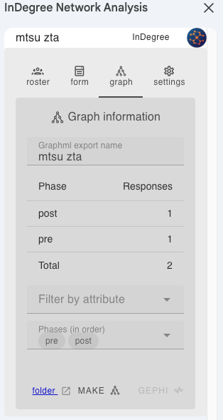

# How to create a phased form from a template

A phase is a stage of a project where you ask the same roster members a potentially different group of questions at a different time. Some of these questions could be the same as previous phases, but others could be different. Processing multiple phases from the same template allows you to measure changes in responses between phases.

Using blocks and tags you can create a form from a template that can be reused across multiple phases (or even multiple projects). 

So what do these things do?

## Template forms

These are skeleton forms that contain placeholders for blocks and tags, and optionally additional regular content. Templates are used to create full forms tailored for each phase

## Blocks

Blocks are used to define sections of the form. For example, you might have a block called "demographics" that contains questions about the person's demographics, that you only want to ask as part of the first phase, or even in an entirely different phase.

You might have a block called "happiness" that contains questions about the person's happiness, that you want to repeat across phases so you can measure changes in happiness over time.

Using blocks allows you to 
- ensure the question structure is exactly the same in each phase
- measure changes in responses across phases. 

The actual content of the block is defined in the rules file, and the block is repeated in each phase, using a syntax like `{{"block": "happiness"}}`  as the section title in your template. The actual content of the block is taken from the rules file and instered into a generated form

## Tags

In order to minimize the number of templates required, tags can be used to 'filter' sections in a template. Filtered out sections of the template are only included in the final generated phase form if the tags associated with that phase allow it to be included.

For example, if you have a demographic question that you only want to ask as part of the first phase, you can use a tag like `{{"include": "demographics"}}` in your template. Then in the UI, when you generate the first phase form, you can add the tag `demographics`. 

In addition to custom tags you create, phases have an implicit tag of the same name as the phase, so a phase named `post` will also have an automatic tag `post`, and you can use the tag `post` to include all sections associated with the post phase.

Multiple tags can be specified in a template, and they are evaluated in order. If a section has multiple tags, it will be included if any of the tags are included and excluded if any of the tags are excluded. A section with no tags will always be included.

Blocks can be combined with tags. For example, you might have a block called 'membership' that you only want to ask as part of a  phase that collects demographics. Use a tag like `{{"include": "demographics","block": "membership"}}` to include the membership   block only in the demographics phase. 


Questions with no "exclude" or "include" filters will always be included in the final form.

## Example

I want to create 2 phases for roster ZTA 
- the 'pre' phase will collect demographics and other initial information as well as happiness, relationships etc that will be measured across both phases
- the 'post' phase will collect happiness, relationships etc, but doesn't need to collect demographics again

We can use the same template for both phases, and use tags to filter out the sections that are not relevant to the phase.

1. Different title sections for the phase. When creating the phase form, you can specify a title section for the phase, which will replace the title section in the template. we'll use UI to cusomize the title section introduction for each phase.
2. Consent section. We only need this in the pre phase, so in the template, we'll use a tag to include it only in the pre phase - like this

````
{{"include": "pre"}}

Consent for Research Participation

Research Study Title: Using Social Network Analysis to Test Intervention Contagion

....etc
````

3. demographics section. We only need this in the pre phase, so in the template, we'll use a tag to include it only in the pre phase - like this

```
{{"include": "pre","block": "demographics"}}
```

However, I'm going to demonstrate the use of another tag. I may at some point want to introduce a new phase to collect the demographics separately, so to future proof, I'm going to add a new tag `demographics` in the UI when creating the pre phase form. This means that the pre phase will have 2 tags `pre` and `demographics`, and the demographics section will be included in the pre phase form if either `pre` or `demographics` is specified in the template. So i'm going to change the previous filter to:

```
{{"include": "demographics","block": "demographics"}}
```


Now we have a template form we can use for both pre and post phases, and optionally a demographics phase if we decide to create one in the future. 


1. A screenshot of the UI when a `pre` phase form with the additional tag `demographics`.



2. A screenshot of the form information once the form has been generated.



3. A screenshot of the UI when preparing the `post` phase form. 



4. A screenshot of the post phase form information once it has been generated.



5. Combining pre and post phase data to create a graph.


